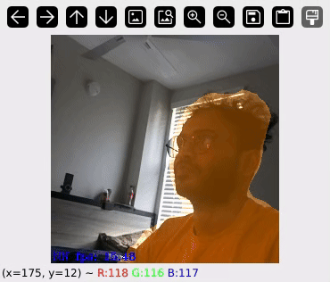
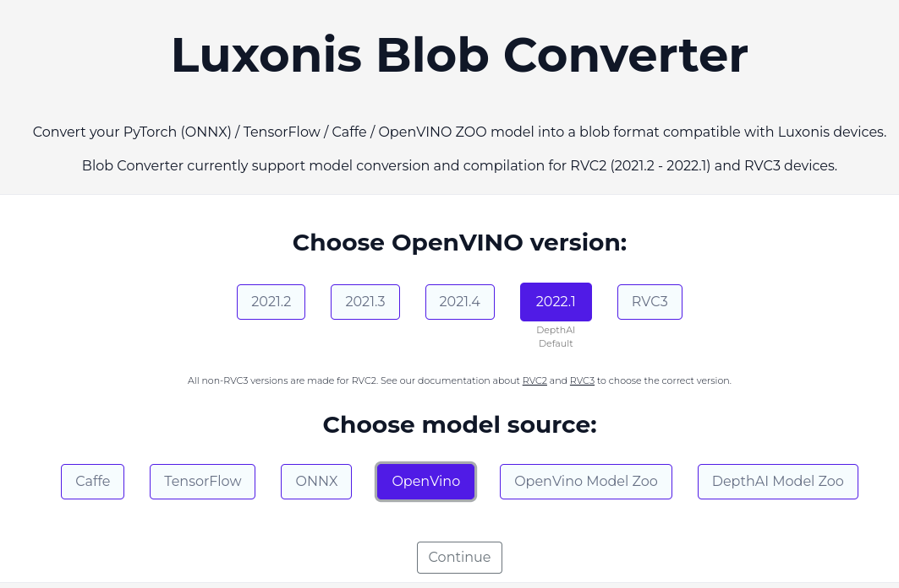
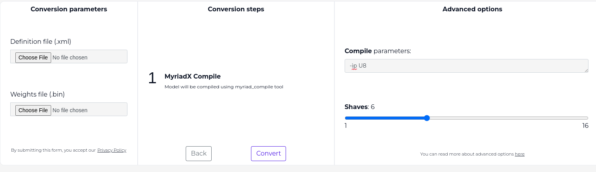

# Oak-D-Segmentation
# Demonstration
## Single Class

## Multi-class

# Setup
## Setup Python Environment

### Requirements:
**OS**: Ubuntu 22.04 (and derivatives) or later
**Architecture**: x86_64

### Conda or Mamba Environment
```sh
conda create -n <name> python=3.9

or

mamba create -n <name> python=3.9
```

### Activate Environment
```sh
mamba activate <name>

or

conda activate <name>
```

### Install Packages
#### Install Tensorflow (Nvidia or CPU)
```sh
mamba install tensorflow

# or

conda install tensorflow 
```

#### Install Other Packages
```bash
pip install scipy matplotlib onnxruntime tf2onnx wandb
```

## Install OpenVINO 2022.01

### Requirements:
**OS**: Ubuntu 20.04 (or derivatives)
### Prerequisites
```bash
sudo apt-get install -y pciutils cpio
```

### Download Runtime
```bash
cd
wget https://github.com/PINTO0309/tflite2tensorflow/releases/download/v1.10.4/l_openvino_toolkit_p_2021.4.582.tgz
tar -xvf l_openvino_toolkit_p_2021.4.582.tgz
```

### Install OpenVINO Runtime
```bash
cd l_openvino_toolkit_p_2021.4.582
bash install_openvino_dependencies.sh 
sed -i 's/decline/accept/g' silent.cfg
bash install.sh --silent silent.cfg
bash /opt/intel/openvino_2021/deployment_tools/model_optimizer/install_prerequisites/install_prerequisites.sh
source /opt/intel/openvino_2021/bin/setupvars.sh
```

expected Output should be similar to:
```
[setupvars.sh] OpenVINO environment initialized
```
## Download Dataset
> If not already created, create a new kaggle API 
```python
cd dataset
bash download_human_parsing_dataset.sh <kaggle_user> <kaggle_api_key>
```
## Restore from Checkpoint

```python
import tensorflow as tf
from deeplabv3plus.model.deeplabv3_plus import DeeplabV3Plus
model = DeeplabV3Plus(backbone='resnet50', num_classes=20)
input_shape = (1, 256, 256, 3)
input_tensor = tf.random.normal(input_shape)
result = model(input_tensor)
model.summary()
```

## Install Oak-D Dependancies
```bash
curl -fL https://docs.luxonis.com/install_dependencies.sh | bash
```

# Training Deeplabv3plus
```bash
python trainer.py human_parsing_resnet50
```

# Realtime Parsing
Follow `realtime.ipynb`

# Blob Conversion
Take the output of `realtime.ipynb` (`.xml` and `.bin` file) and head to https://blobconverter.luxonis.com/

Select as follows and hit continue:

Upload the XML and Bin Files and configure as seen below

finally Download Blob file

## Test Real time Segmentation

Move the Downloaded `.blob` file to `blob/` folder

> Create a new conda / mamba environment for testing on camera

```bash
mamba create -n real_time python=3.9
mamba activate real_time
pip install depthai=2.16.0.0 opencv-python
```

```bash
python cam_test.py
```